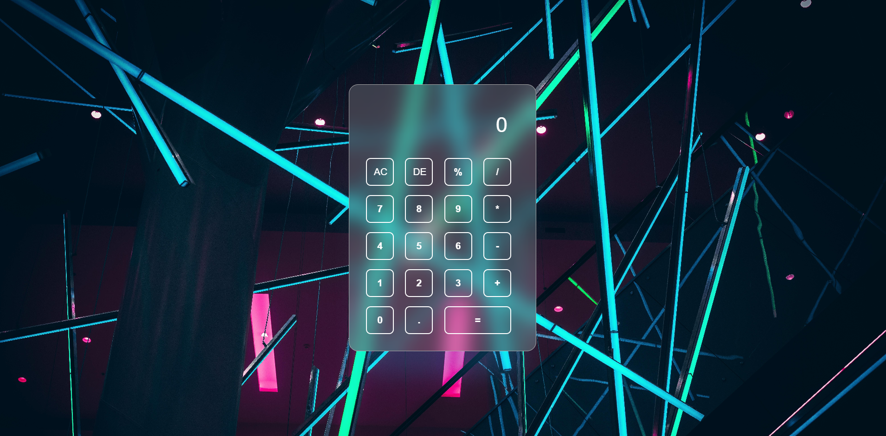

<div align="center">

# 🧮 Calculator

**A sleek, glassmorphism-styled calculator built with vanilla web technologies.**


</div>

---

## ✨ Overview

**Calculator** is a minimalist yet visually striking web calculator. It combines a **glassmorphism** aesthetic with vibrant neon hover effects, built entirely without frameworks — just pure HTML, CSS, and JavaScript.

The design places the calculator over a dark, atmospheric background, creating a modern and premium user experience straight out of the box.

---

## 🎨 Features

- **Glassmorphism UI** — translucent card with backdrop blur for a frosted glass look
- **Neon glow effects** — cyan and pink glows on button hover for a cyberpunk feel
- **Full arithmetic support** — addition, subtraction, multiplication, division, and percentage
- **AC / DE controls** — clear all or delete the last character
- **Decimal support** — `.` button for floating-point calculations
- **Responsive centering** — always perfectly centered regardless of screen size
- **Zero dependencies** — no libraries, no frameworks, just the web platform

---

## 📁 Project Structure

```
Calculator/
├── index.html        # App structure and button layout
├── style.css         # Glassmorphism design, neon effects, layout
├── script.js         # Button event handling and logic
├── Imagenes/
│   └── background5.jpg   # Dark atmospheric background
└── Logo/
    ├── logo1.png
    └── logo2.png         # Favicon used in the browser tab
```

---

## 🚀 Getting Started

No build step required. Just open the file in your browser.

**Option 1 — Open directly:**
```bash
# Clone the repository
git clone https://github.com/your-username/Calculator.git

# Open in browser
open Calculator/index.html
```

**Option 2 — Serve locally** *(recommended for best results)*:
```bash
# Using VS Code's Live Server extension, or:
npx serve .
```

Then navigate to `http://localhost:3000` in your browser.

---

## 🖥️ Preview

<div align="center">



</div>

> The calculator features a fully transparent interface layered over a dark neon background, creating a premium depth effect. Buttons glow **cyan** on number hover and **pink** on operators and controls.

---

## 🧠 How It Works

All logic lives in `script.js`. The approach is straightforward:

```js
// Each button appends its value to a string
string += e.target.innerHTML;

// "=" evaluates the expression
string = eval(string);

// "AC" resets everything
string = "";

// "DE" removes the last character
string = string.substring(0, string.length - 1);
```

Button events are attached via `querySelectorAll('button')`, iterating over the full button set and dispatching behavior based on the button's content.

---

## 🎨 Design System

| Element | Value |
|---|---|
| Font | Poppins |
| Card background | `rgba(255, 255, 255, 0.18)` |
| Backdrop blur | `20px` |
| Border radius | `20px` |
| Number hover glow | `#03e9f4` (cyan) |
| Operator / equal hover glow | `#fa36a2` (pink) |
| Card shadow | Blue-tinted `rgba(41, 168, 255, 0.2)` |

---

## 📄 License

This project is open source and available under the [MIT License](LICENSE).

---

<div align="center">

Made with ❤️ and vanilla JavaScript

</div>
